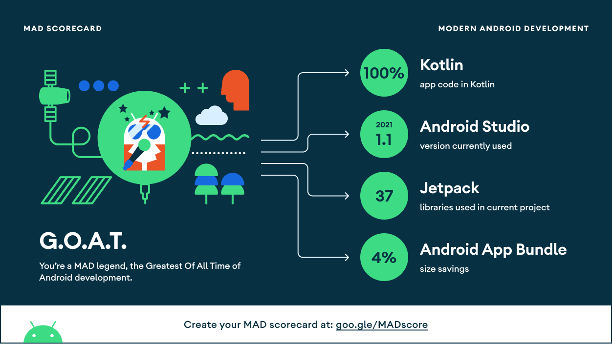

 

<!---->

#

Jenci is a project that includes necessary actions for Jenkins developed with Android Jetpack Compose. Jenci, Jenkis API services include some actions
performed through Jenkis. Jenkis users, inspect view/job/build details. Users can use many features such as build and start options through the Jenci
Project.

Project developed with Clean Architecture, SOLID principles and MVI pattern + ViewModel. Jenci was shared as open source to set an sample project for
Android Jetpack Compose.

https://user-images.githubusercontent.com/6595568/158034066-82ab398a-144c-4963-a923-d6e06253a81d.mp4

## Screenshots

## Features

- Account registration.
- Login/Authorization.
- Add many accounts and watch these accounts.
- Monitorize the views.
- Monitorize the views' details.
- Monitorize the Jobs.
- Monitorize the Jobs' details.
- Monitorize the builds.
- Monitorize the bulids' details.
- Start the build.
- Monitorize the queues.
- Queue cancel.
- Jenkins actions:
  - Restart
  - Shutdown
  - Quiet Down
- Monitorize the users.
- Monitorize the profile information.
- Secure Logout

## Architecture & Design Patterns

* [Clean Architecture](#clean-architecture)
* [SOLID](#)
* [MVI](#mvi-pattern)
* [Repository Pattern](#)

## Libraries Used

### Compose

* [Compose UI](#)
* [Compose Util](#)
* [Compose Preview](#)
* [Compose Activity](#)
* [Compose Navigation](/presentation/src/main/java/com/x/presentation/navigation)
* [Compose MaterialIcons](#)
* [Compose Material3](/presentation/src/main/java/com/x/presentation/ui/theme)
* [Compose Dagger Hilt Navigation](#)

### Libs

* [Dagger Hilt](/presentation/src/main/java/com/x/presentation/di)
* [Coroutines](#)
* [Material](#)
* [Splash Screen](/presentation/src/main/java/com/x/presentation/scene/splash/SplashActivity.kt#L38)
* [Security Crypto](/data/src/main/java/com/x/data/cache/CachePreferencesImpl.kt#L20)
* [Gson](/data/src/main/java/com/x/data/util/GsonHelper.kt)
* [Room](/data/src/main/java/com/x/data/db)
* [retrofit](/presentation/src/main/java/com/x/presentation/di/ApiModule.kt)
* [okHttp](/presentation/src/main/java/com/x/presentation/di/ApiModule.kt#L90)
* [moshi](/data/src/main/java/com/x/data/util/MoshiHelper.kt)
* [seismic](/presentation/src/main/java/com/x/presentation/util/ShakeUtil.kt)
* [chucker](/presentation/src/main/java/com/x/presentation/di/ApiModule.kt#L64)
* [leakCanary](#)
* [Datastore*](/data/src/main/java/com/x/data/store)

### Accompanist

* [Pager](/presentation/src/main/java/com/x/presentation/scene/account/login/LoginScreen.kt#L378)
* [Pager Indicator](/presentation/src/main/java/com/x/presentation/scene/account/login/LoginScreen.kt#L415)
* [SystemUiController](/presentation/src/main/java/com/x/presentation/scene/main/MainActivity.kt#L36)
* [FlowLayout](/presentation/src/main/java/com/x/presentation/scene/main/dashboard/DashboardScreen.kt#L616)
* [SwipeRefresh](/presentation/src/main/java/com/x/presentation/scene/main/dashboard/DashboardScreen.kt#L172)
* [InsetsUi](/presentation/src/main/java/com/x/presentation/scene/main/job/detail/JobDetailScreen.kt#L296)
* [NavigationAnimation](/presentation/src/main/java/com/x/presentation/ui/composable/NavAnimation.kt)

### Firebase

* [Crashlytics](#)
* [Analytics](#)

### Other

* [mpAndroidChart](/presentation/src/main/java/com/x/presentation/ui/composable/Chart.kt)
* [javax](#)
* [xException](/presentation/src/main/java/com/x/presentation/JenciApp.kt#L20)
* [Timber](/common/src/main/java/com/x/common/logger/LoggerImpl.kt)

> '*' Available but unused. It has not been added to the public repo.

## Clean Architecture

## MVI Pattern

## MAD Scorecard

